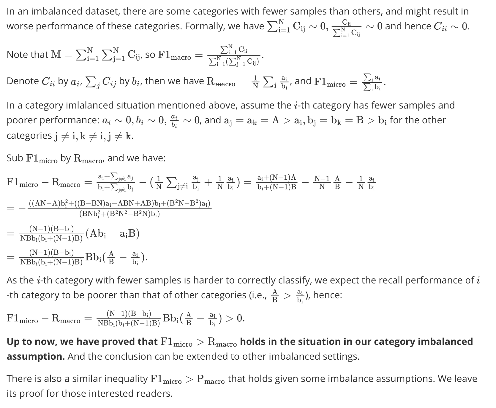

# Baselines

This folder contains some implementations of ED baselines on our dataset (***including the experimental results and download link to pre-trained model weights***). With carefully hyper-parameter tuning and more training steps, we reproduce better baseline results.

## Included Baseline Models

- [DMCNN](./DMCNN/README.md)
- [JMEE](./JMEE/README.md)
- [JRNN](./jointEE-NN/README.md)

## Discussions About Multi-class Classification Metrics


### Category Imbalanced Classification



#### Case Studies

Here are some supporting cases where the Micro F1 score is larger than Macro Precision and Macro Recall in a category imbalanced setting.

Given a 3-category classification task with 10 samples: `y=[0,0,0,1,1,1,1,2,2,2]`, where 3-th category (id=`2`) has fewer samples than other categories. By executing the following scripts:

```python
from random import randint
from sklearn.metrics import f1_score, precision_score, recall_score

num_labels = 3
y = [0, 0, 0, 0, 1, 1, 1, 1, 2, 2]
while True:
    pred = [randint(0, 2) for _ in range(len(y))]
    if len(set(pred)) < num_labels:
        continue
    pi = precision_score(y, pred, average='micro')
    pa = precision_score(y, pred, average='macro')
    ri = recall_score(y, pred, average='micro')
    ra = recall_score(y, pred, average='macro')
    fi = f1_score(y, pred, average='micro')
    fa = f1_score(y, pred, average='macro')
    if fi > max(pa, ra):
        print('pred =', pred)
        print('micro: p = {:.4f}, r = {:.4f}, f1 = {:.4f}'.format(pi, ri, fi))
        print('macro: p = {:.4f}, r = {:.4f}, f1 = {:.4f}'.format(pa, ra, fa))
        break
```

Some cases found:

```python
# Case 1:
pred = [1, 1, 0, 0, 1, 2, 1, 1, 0, 1]
micro: p = 0.5000, r = 0.5000, f1 = 0.5000
macro: p = 0.3889, r = 0.4167, f1 = 0.3905

# Case 2:
pred = [2, 2, 1, 0, 1, 1, 1, 0, 1, 1]
micro: p = 0.4000, r = 0.4000, f1 = 0.4000
macro: p = 0.3333, r = 0.3333, f1 = 0.3111

# Case 3:
pred = [0, 0, 1, 0, 2, 1, 1, 1, 0, 1]
micro: p = 0.6000, r = 0.6000, f1 = 0.6000
macro: p = 0.4500, r = 0.5000, f1 = 0.4722
```
